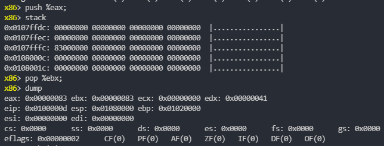

# x86 assemble interactive shell

using [keystone](http://www.keystone-engine.org/) and [unicorn](http://www.unicorn-engine.org/) as backend, [linenoise](https://github.com/yhirose/cpp-linenoise) as readline library.

## build
0. git clone https://github.com/hycares/x86shell
1. download keystone and unicorn project and follow the documents to install
2. git clone https://github.com/yhirose/cpp-linenoise and move "linenoise.hpp" to this project, it's a header only library
3. make

## preview

## thanks

inspired by [asmshell](https://github.com/poppycompass/asmshell)
